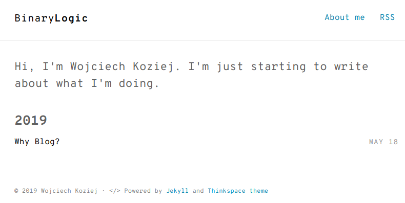

---
layout: post
title: "Why Blog"
tags:
    - python
    - notebook
--- 
# Why should I write another blog
So why another blog? Mainly because I want to check and improve myself.
Secondly, I hope you will benefit. 
 
## Inspirations 
 
Of course, there are [inspirations](https://www.fast.ai/2019/05/13/blogging-
advice/) which made me start writing. And I want to master some skills:
 * to write in English
 * to create a post in [jupyter notebook](https://jupyter.org/) 
 
## First post
So my first post describes how to create it in jupyter notebook and make it
available for you on [github pages](https://wkoziej.github.io).
 
 
### Create and name the notebook
I assume you [installed](https://jupyter.org/install) jupyter notebook, so we
can start writing the article locally. Create a new notebook and rename it to
"Why Blog?" or your favourite name. We save this name into python variable
called __notebook_name__ 

**In [96]:**


notebook_name = 'Why Blog'

 
### Assign a date to notebook name 
 
We will use [Jekyll](https://jekyllrb.com/) for serving post and that's why you
should name your blogs using defined date format: YYYY-MM-DD. It allows grouping
posts. Let's take the current date. 

**In [97]:**


import datetime
date = datetime.date.today()

 
Now we can create posts name for Jekyll 

**In [98]:**


post_name="{}-{}".format(date, notebook_name)

 
### Convert notebook into markdown format 
 
Jekyll can serve markdown files and so we convert the post into markdown format
using the great [nbconvert](https://nbconvert.readthedocs.io/en/latest/) tool.
Make sure you have correct path to your notebook. 

**In [99]:**


!ls "{notebook_name}".*


    'Why Blog.ipynb'

 
Convert notebook format into markdown file 

**In [100]:**


!jupyter nbconvert "{notebook_name}.ipynb" --to markdown --config jekyll.py --output="{post_name}"


    [NbConvertApp] Converting notebook Why Blog.ipynb to markdown
    [NbConvertApp] Support files will be in 2019-05-18-Why Blog_files/
    [NbConvertApp] Making directory /home/wojtas/dev/work/2019-05-18-Why Blog_files
    [NbConvertApp] Writing 5218 bytes to /home/wojtas/dev/work/2019-05-18-Why Blog.md

 
We created a couple of files in the workin directory __post_working_dir__. We
save it name. 

**In [109]:**


post_working_dir=!pwd
post_working_dir = post_working_dir[0]

 
I assume you created your [github project for blog
purpose](https://pages.github.com/) and you have a local copy of your repo in
__blog_working_directory__ 

**In [57]:**


blog_working_dir="/home/wojtas/dev/blog"
!cp "{post_working_dir}/{post_name}.md" "{blog_working_dir}/_posts"

 
### Test it locally 
 
Go into __blog_working_directory__ and run jekyll server
```
bundle exec jekyll serve --incremental
``` 
 
### Push changes and test effects 
 
Go into your __blog_working_directory__ and add created post 

**In [62]:**


!cd {blog_working_dir} && git add "{blog_working_dir}/_posts/{post_name}.md" && git commit -m "First post"


    [master aaf989c] First post
     1 file changed, 167 insertions(+)
     create mode 100644 _posts/2019-05-18-Why Blog?.md

 
Then push your changes wait a minute or two and check [your
site](https://wkoziej.github.io) (replace you github login in url :)). You will
see something similar to picture below:


Remember about proper path when referring images (see next section). 
 
## So, pictures 
 
Of course, you want to add some pictures into your notebook/blog. So you have to
copy them into gitlab project too. 
 
### Pictures generated by notebooks 
 
Let's create a simple image 

**In [69]:**


%matplotlib inline
import matplotlib.pyplot as plt
time = [0, 1, 2, 3]
position = [0, 100, 200, 300]

plt.plot(time, position)
plt.xlabel('Time (hr)')
plt.ylabel('Position (km)')



    Text(0, 0.5, 'Position (km)')


 
 

 
And copy all post images into the blog project 

**In [102]:**


!cp "{post_working_dir}/{post_name}_files/"*.png {blog_working_dir}/assets/images

 
### Picture names are generated 
 
* Names of pictures generated by jupyter are alse generated so you have to add
and commit into repo pictures connected with your generated post!
* If you rerun your notebook conversion then nbconvert generates new pictures
(and new links in markdown doc) so you should delete old ones from repo :( 
 
### Path to pictures referred in notebook markdown 
 
If you want to include a picture in your notebook like this and test it locally
you should make the correct folder in your system.

For such reference
```

```

I don't know how to automate this yet :( 
 
## All in one cell, to rule them all 

**In [112]:**


!jupyter nbconvert "{notebook_name}.ipynb" --to markdown --config jekyll.py --output="{post_name}"
!cp "{post_working_dir}/{post_name}_files/"*.png {blog_working_dir}/assets/images
!cp "{post_working_dir}/{post_name}.md" "{blog_working_dir}/_posts"


    [NbConvertApp] Converting notebook Why Blog.ipynb to markdown
    [NbConvertApp] Support files will be in 2019-05-18-Why Blog_files/
    [NbConvertApp] Making directory /home/wojtas/dev/work/2019-05-18-Why Blog_files
    [NbConvertApp] Writing 5836 bytes to /home/wojtas/dev/work/2019-05-18-Why Blog.md


**In [None]:**




